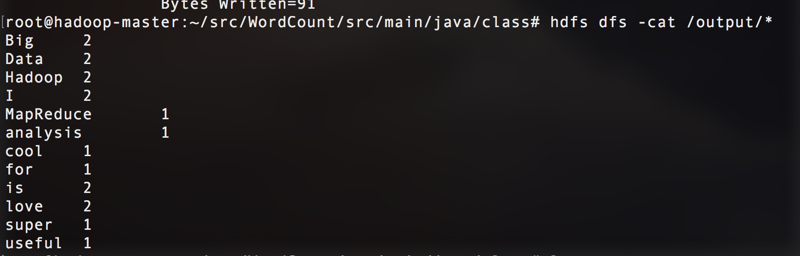

# Word Count

## Goal:
count the frequency of each word in a collection of files

## Workflow
+ Mapper: read raw input and split into words
    - input: < offset, line of words >
    - ouput: < key=word, value=1 >

+ Reducer: merge the ouput from Mapper to count the total frequency of each word
    - input: < key=word, value=< 1, 1, ... , 1 > >
    - output: < key=word, value=sum >

## Run code:
First start your Hadoop module, then enter the WordCount file by

    $: cd WordCount/
    $: hdfs dfs -mkdir /input
    $: hdfs dfs -put input/* /input/
    $: cd src/main/java/
    $: hadoop com.sun.tools.javac.Main -d class *.java
    $: cd class/
    $: jar cf wordCount.jar *.class
    $: hadoop jar wordCount.jar Driver /input /output
    $: hdfs dfs -cat /output/*

### Demo of output

